# Tips for Getting Started Writing for Web Accessibility
## 网页可访问性编写的原则 (麦安琪：181013118  丁晓莹：181013129）
***摘要：*** 此readme.md文档介绍了一些基本的需要考虑的注意事项，来帮助您开始写残疾人更容易访问的Web内容。这些原则是帮助您满足Web Content Accessibility Guidelines（WCAG）要求的良好做法。遵循相关WCAG要求的链接，理解文档中的详细背景、教程指南和用户案例等等。

***页面内容***
* 提供有用的信息、独特的页面标题
* 用标题传达含义和结构
* 让链接文字有意义的
* 为图片编写有意义的文本替代品
* 创建多媒体的文字记录和说明文字
* 提供明确的说明
* 保持内容清晰和简洁

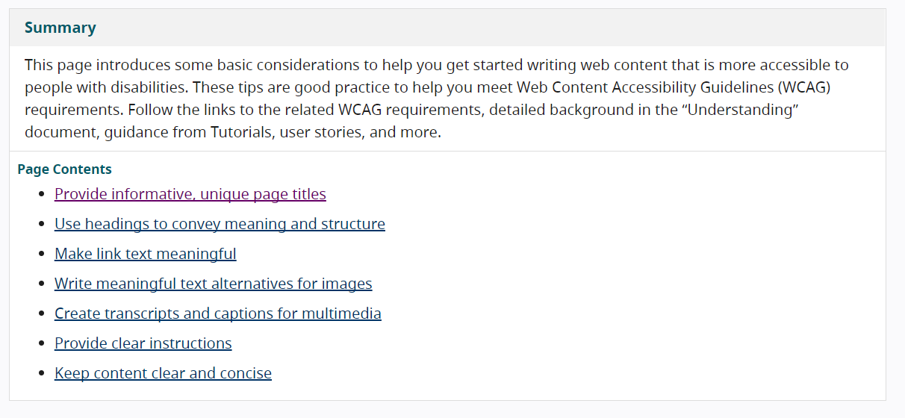

### 提供有用的信息、独特的页面标题
对于每个网页，提供简短的标题，以至于描述页面内容并将其与其它页面区分。页面标题通常与页面主要标题相同。把独特以及最相关的信息放在首位；例如：将页面名称放在组织名称之前。对于多步骤过程的页面，请在页面标题中包括现在的步骤。

**示例：页面标题**
* ***主页标题：*** Space Teddy Inc.
* ***页面名称后面跟着组织名称：*** Latest News • Space Teddy Inc.
* ***包括流程中步骤的页面名称：*** Buy Your Bear (Step 1 of 3) • Space Teddy Inc.

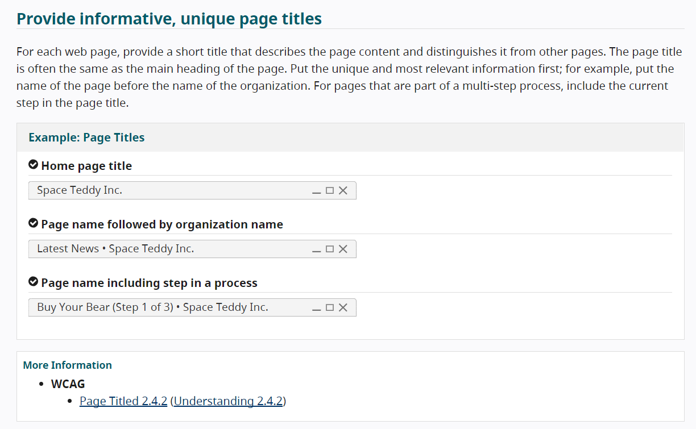

----

### 用标题传达含义和结构
使用短标题把相关段落分组并且清楚地描述各个部分。好的标题提供了内容的概述简述。

**示例：使用标题来组织内容**
* ***标题缺乏***（下图左）
* ***使用标题和副标题***（下图右）

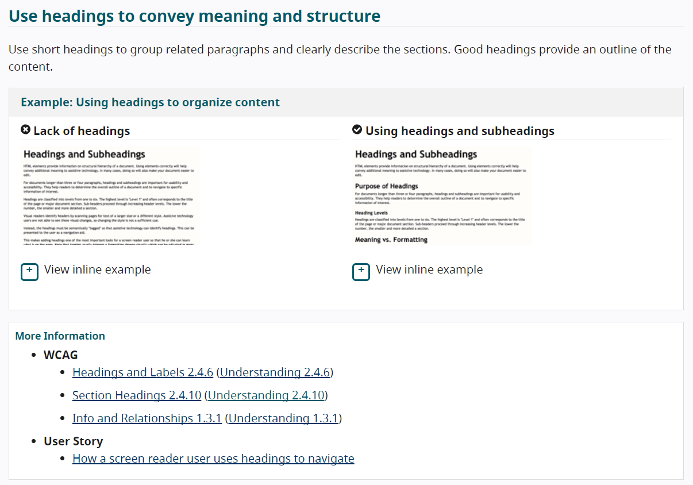

----

### 让链接文字有意义的
写链接文本，用来描述链接目标的内容。避免用模棱两可的链接文本，例如“单击此处”或“阅读更多”。指示有关链接目标相关的信息，例如：文档的类型和大小，又例如：“建议文档（RTF，20MB）”。

**示例：使用链接文本来描述目标页面**
* ***无信息：*** 有关设备独立性的更多信息，[请单击此处](https://baike.baidu.com/item/%E8%AE%BE%E5%A4%87%E7%8B%AC%E7%AB%8B%E6%80%A7/7095927?fr=aladdin)。
* ***有意义的信息：*** 阅读[有关设备独立性](https://baike.baidu.com/item/%E8%AE%BE%E5%A4%87%E7%8B%AC%E7%AB%8B%E6%80%A7/7095927?fr=aladdin)的更多信息。

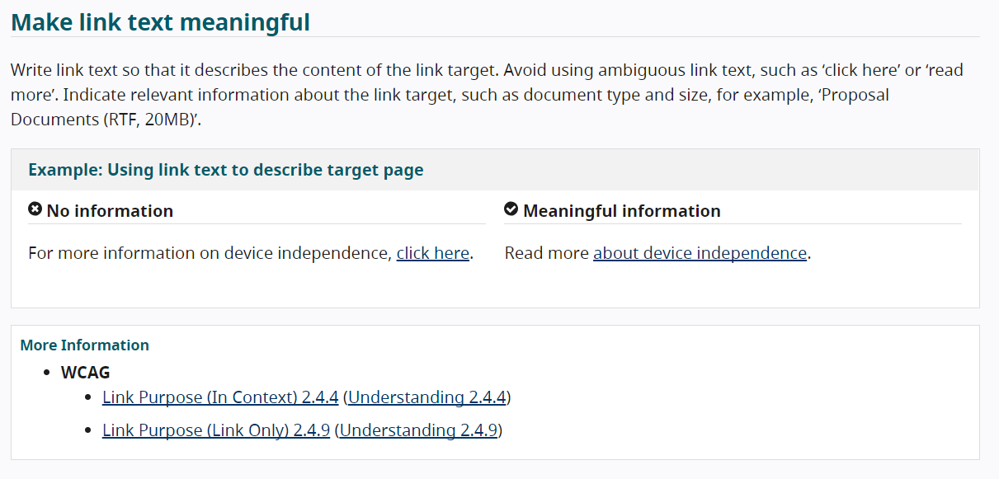

----

### 为图片编写有意义的文本替代品
对于每个图像，编写能提供图像信息或者功能的替代文本。对于纯装饰性图像，不需要编写替代文本。

**示例：使用替代文本去沟通重要信息**

* ***无信息*** 
	* 充电：使用提供的电缆和电源适配器将手机连接到电源插座  
	* 图片的替代文本：“正在充电”  

* ***信息丰富的***  
	* 充电：使用提供的电缆和电源适配器将手机连接到电源插座 
	* 图片的替代文本：“将电缆插入手机的底部边缘”  

*替代文字通常是看不见的；它包含在例子中只是为了您可以看到它是什么*

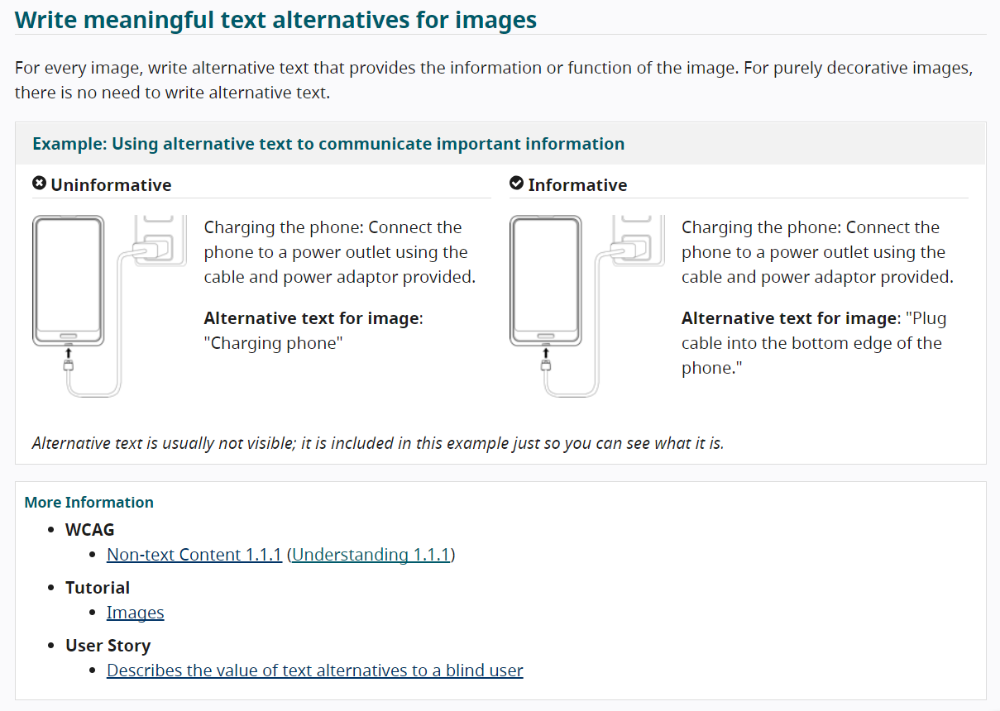

----

### 创建多媒体的文字记录和说明文字
对于只有音频的内容，例如播客，请提供文字记录。对于音频和视频内容，如培训视频，也提供字幕。在文字记录和说明中包含对理解内容很重要的口头信息和声音，例如，“门吱嘎声”。对于视频记录，还包括对重要视觉内容的描述，例如“Athan 离开房间”。

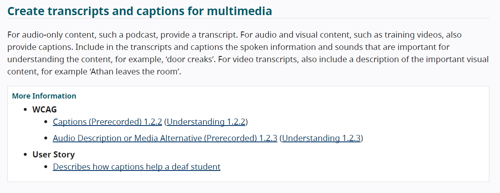

----

### 提供明确的说明
确保指令、指导和错误消息清晰、容易理解，并避免使用不必要的技术语言。描述输入需求，例如日期格式。

**示例：说明传达什么信息是用户需要提供的**  

密码至少应包含六个字符，并且至少包含一个数字（0-9）  

**示例：错误指示问题是什么，以及如何解决它**
 * 用户名“ superbear”已在使用中
 * 密码必须至少包含一个数字

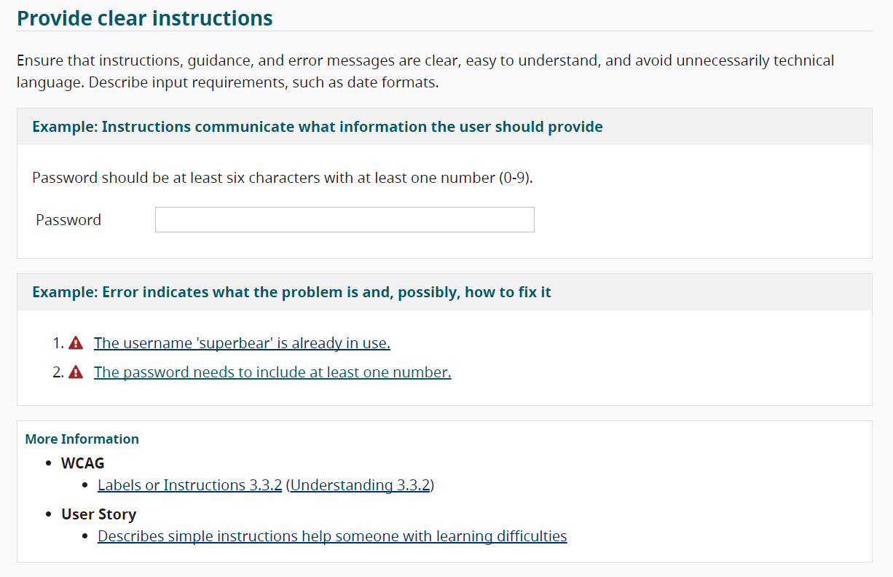

----

### 保持内容清晰和简洁
根据情况，使用简单的语言和格式  
* 写简短、清晰的句子和段落
* 避免使用不必要的复杂单词和短语。考虑为读者可能不知道的术语提供一个术语表
* 首次使用时用缩写。例如，Web内容可访问性指南（WCAG）
* 适当使用列表格式
* 考虑使用图像，插图，视频，音频和符号来帮助阐明含义

**示例：使内容更易阅读和理解**
* ***不必要的复杂***  
CPP:一旦发生车辆碰撞，公司指派的代表寻求查明所涉各方财产的损害程度和原因。一旦我们的代表获得信息，使我们能够理解因果关系，我们可能会或可能不会分配适当的金钱补偿。最终的决定会引起以下选项之一:索赔是不批准并分配一个拒绝状态,说法模棱两可的状态,将需要额外的信息进行进一步的处理之前，部分索赔已获批准并且减免了付款。分配和签发，或者索赔已完全批准，并且分配了总索赔付款。  

* ***更容易理解***  
索赔处理程序（CPP）：如果您发生车祸，我们的代理商将进行调查。调查结果将确定任何索赔款项。这可能导致：
	* 批准索赔-全额付款
	* 部分批准索赔-减少付款
 	* 待定索赔-需要更多的信息
	* 拒绝索赔-无付款
 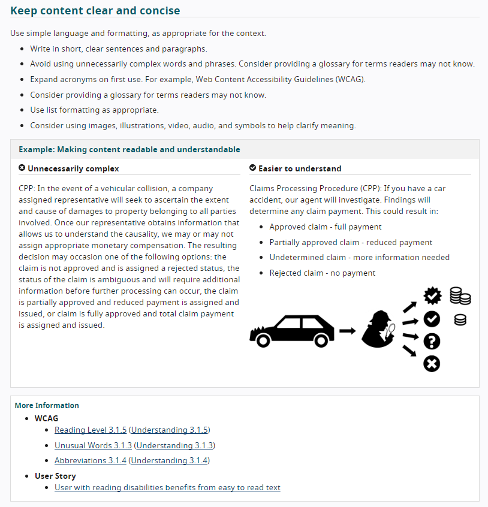

----

# 根据WAI原则点评任意一个网站
本次点评的是“稿定设计”的官网 [点击可进入“稿定设计”](https://www.gaoding.com/)

### 保持内容清晰和简洁
* **板块区分明确，主要分为[左-中-右]3个模块，格式简单清晰**

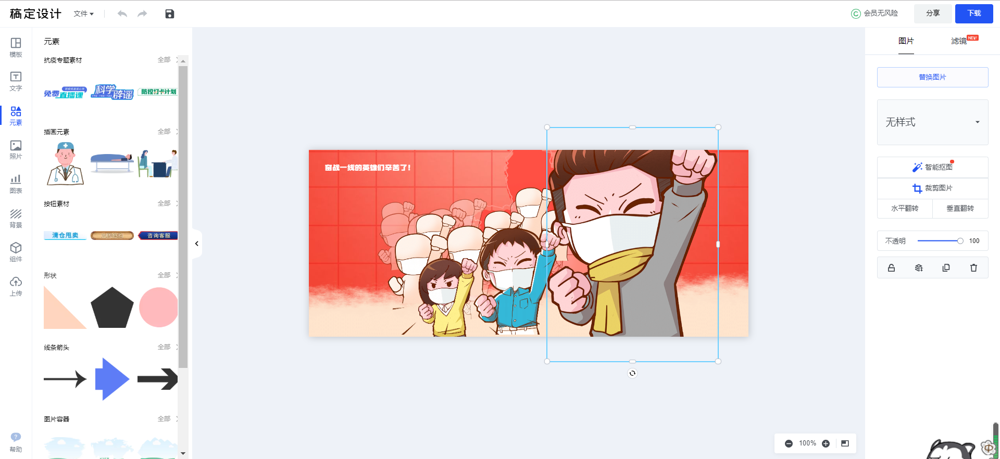

* **页面使用了（如下图）简单的短句和短词，使内容更易阅读和理解，避免了不必要的复杂**

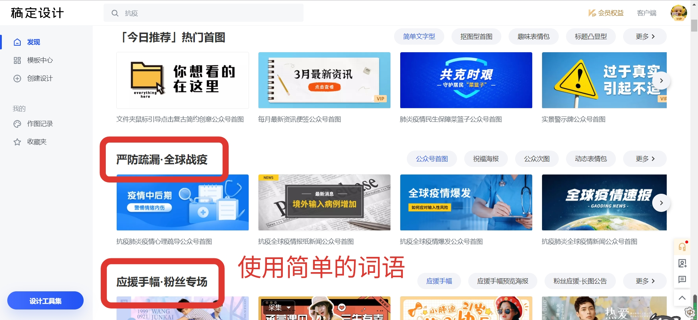

* **使用了列表的格式，分类清晰，版面简单美观**

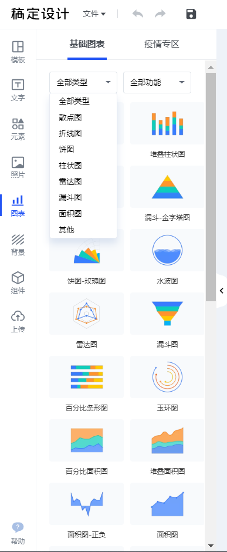

* **使用图像（如下图）来阐明，直观展示此模板的外观，直观清晰易懂**

### 提供有用的信息、独特的页面标题

* **首页提供了丰富且有用的信息**

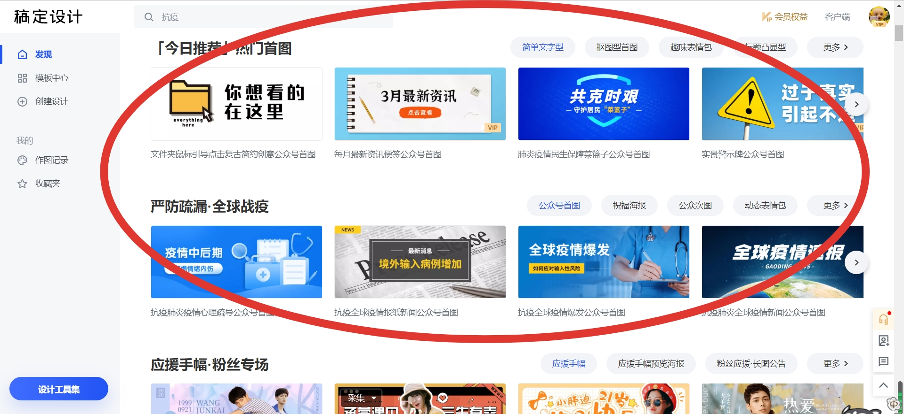

* **简短的页面标题**

左侧导航栏和banner下面的导航栏对于每个网页，以及模板中心里面的导航栏，都提供了简短的标题，以至于描述页面内容并将其与其他页面区分开

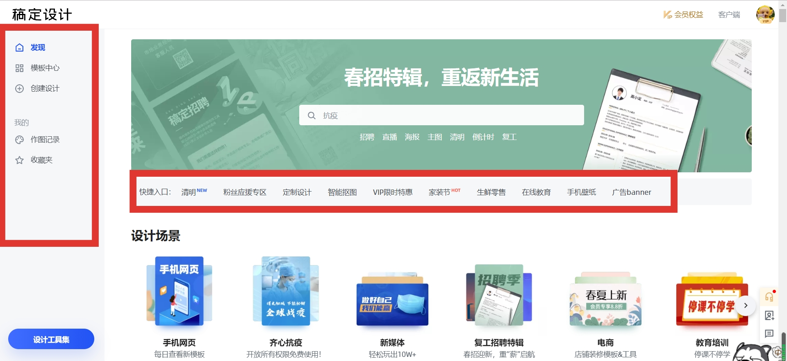

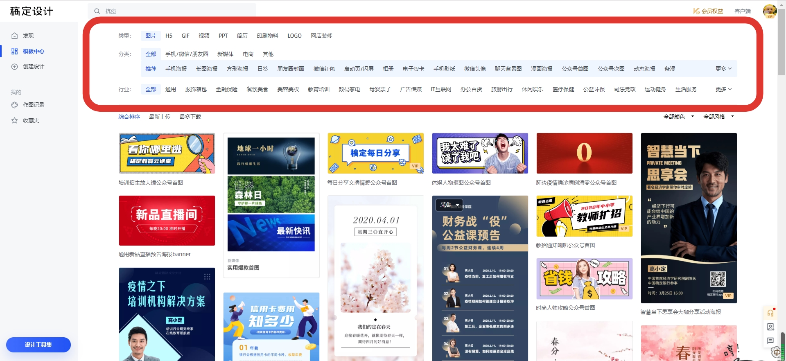

* **独特的页面标题**

点击导航栏里的“作图记录”，跳转到“作图记录”的页面。此为把独特以及最相关的信息放在首位，即我们可以看到的最顶部的“作图记录”，此标题亦有“区分目前页面内容与其他页面内容”的作用。而下方紧跟着的是“模板记录”“抠图记录”“电商装修记录”，简单清晰表明了这3个即将点击的页面的主要内容。

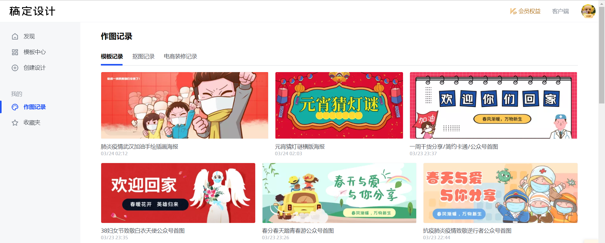

### 用标题传达含义和结构

**使用短标题，把内容进行分组**
如下图，此为3个部分的内容

### 让链接文字有意义
**此文本为“点击在线编辑”，用来描述链接目标的内容，即：你点击便可进入在线编辑页面，清楚指示了有关目标相关的信息**

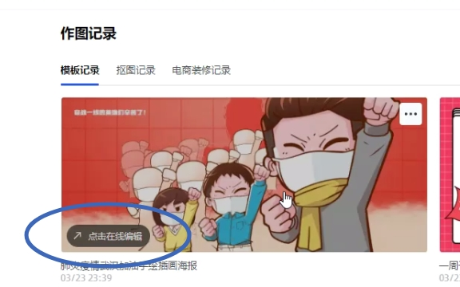

### 为图片编写有意义的文本
**使用文本去描述，此文字编写能够为图像提供信息或者功能的简单描述**

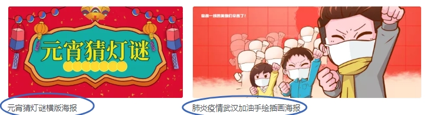

### 提供明确的说明
**明确指出目前的问题是什么 → “版权提示”，以及如何解决它 → “会员可免费使用”**

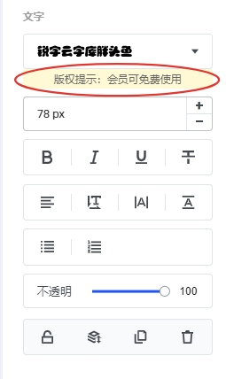

